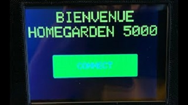

# Station météo

# Images

 

# Description du projet

Avec un senseur BME280, on récupère la température, l'humidité, la pression atmosphérique, et on envoie les informations vers Home Assistant un logiciel de domotique avec MQTT(PUB/SUB).
Le 2eme esp32 avec l’écran tactile ILI9488 sert comme wifi manager et affiche les informations de la bme280, et affiche aussi la météo locale a l’aide d’un API.

# Planification et attribution des tâches et description des étapes du projet

Pour la planification de ce projet, nous avons premièrement pris conscience entièrement des besoins du client pour ensuite commencer à élaborer un plan et à déterminer nos objectifs. Nous avons établi un calendrier et mener une évaluation de la difficulté des tâches à venir pour anticiper les problèmes éventuels possibles.

Nous avons décidé que Raphaël s’occuperais de la programmation de la station d’affichage et Marc-Antoine de la station émettrice. Nous avons décidé d’utiliser la technologie « esp-now » qui nous permet de faire communiquer plusieurs esp32 entre eux pour échanger les données de connexion au réseau. Ce qui permet d’éviter une configuration plus complexe passant par un client sur un navigateur web.

# Schéma technique

 

# Diagram de classes

# DEMO
https://www.youtube.com/watch?v=gJ58MvmqERE
